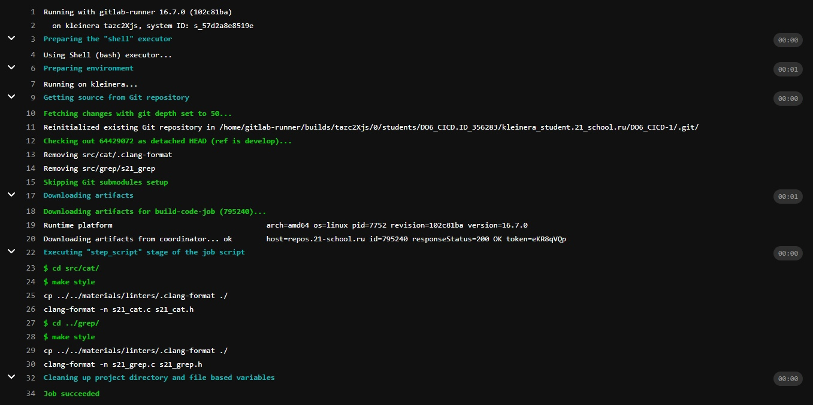

# Basic CI/CD

## Part 1. Настройка gitlab-runner

+ ***Подними виртуальную машину Ubuntu Server 20.04 LTS***
  
  

+ ***Скачай и установи на виртуальную машину gitlab-runner***
   
    ```
    sudo curl -L --output /usr/local/bin/gitlab-runner "https://gitlab-runner-downloads.s3.amazonaws.com/latest/binaries/gitlab-runner-linux-amd64"

    sudo chmod +x /usr/local/bin/gitlab-runner

    sudo useradd --comment 'GitLab Runner' --create-home gitlab-runner --shell /bin/bash

    sudo gitlab-runner install --user=gitlab-runner --working-directory=/home/gitlab-runner
    ```

+ ***Запусти gitlab-runner и зарегистрируй его для использования в текущем проекте (DO6_CICD)***
  
  ***Запускаем gitlab-runner***

  

  ***Регистрируем для использования***

  

## Part 2. Сборка

+ ***Напиши этап для CI по сборке приложений из проекта C2_SimpleBashUtils:***
  1) ***В файле gitlab-ci.yml добавь этап запуска сборки через мейк файл из проекта C2***
   
  2) ***Файлы, полученные после сборки (артефакты), сохрани в произвольную директорию со сроком хранения 30 дней.***
  
  ***Прописываем build в .gitlab-ci.yml***
  
  

  ***Результат сборки***
  
  

## Part 3. Тест кодстайла

+ ***Напиши этап для CI, который запускает скрипт кодстайла (clang-format):***
  1) ***Если кодстайл не прошел, то «зафейли» пайплайн***
   
  2) ***В пайплайне отобрази вывод утилиты clang-format***
  
  ***Прописываем codestyle в .gitlab-ci.yml***

  

  ***Результат сборки + кодсайтлинга***

  


## Part 4. Интеграционные тесты

+ ***Напиши этап для CI, который запускает твои интеграционные тесты из того же проекта:***
  1) ***Запусти этот этап автоматически только при условии, если сборка и тест кодстайла прошли успешно***
   
  2) ***Если тесты не прошли, то «зафейли» пайплайн***
   
  3) ***В пайплайне отобрази вывод, что интеграционные тесты успешно прошли / провалились***
   
+ ***Прописываем test_code в .gitlab-ci.yml***
  
  

  ***Результат выполнени тестов***

  

## Part 5. Этап деплоя

+ ***Подними вторую виртуальную машину Ubuntu Server 20.04 LTS***
  
  ***Поднимаем вторую виртуалку***

  

+ ***Напиши этап для CD, который «разворачивает» проект на другой виртуальной машине:***
  1) ***Запусти этот этап вручную при условии, что все предыдущие этапы прошли успешно***
  
  2) ***Напиши bash-скрипт, который при помощи ssh и scp копирует файлы, полученные после сборки (артефакты), в директорию /usr/local/bin второй виртуальной машины***
   
  3) ***В файле gitlab-ci.yml добавь этап запуска написанного скрипта***
   
  4) ***В случае ошибки «зафейли» пайплайн***
   
   ***Открываем netplan на обеих VM и меня адресса, для того, чтобы прокинуть***

   

   ***Также прописываем на второй VM sudo systemctl enable ssh для удаленного доступа с первом виртуалки***

   

  ***Написали скрипт, который будет копировать файлы с одной виртуалки и переносить их на вторую***

  

  ***Указываем все необходимое в .gitlab-ci.yml***

  

  ***Результаты стадии deploy (все предыдущие этапы прошли успешно)***

  

## Part 6. Дополнительно. Уведомления

+ ***Настрой уведомления о успешном/неуспешном выполнении пайплайна через бота с именем «[ваш nickname] DO6 CI/CD» в Telegram***
  1) ***Регистрируем тг-бота с помощью тг-бота - @BotFather***
  2) ***Получаем токен-бота***
  3) ***Вся следующая необходимая информация есть в materials/notifications.md***
  4) ***.gitlab-ci.yml после необходимых изменений будет выглядить следующим образом (в каждом таргете мы указали after_script с выполнением нашего bash-скрипта):***
   
   

   5) ***Непосредественно напишем bash-скрипт для уведомлений***
   
   

   6) ***Пушим и проверяем, что уведомления приходят***
   
   